






  <h2>Hi, I am tiangan :)</h2>

# 📄 Projects

**[AI Chatbot](http://xihuanwanyuanshen.icu/)**

本项目基于先进的LLM技术，整合了DeepSeek、OpenAI等领先的生成式AI模型，提供高效、智能的对话服务。项目采用现代化的微服务架构，部署于云端，具备高可用性和可扩展性，能够满足多样化的业务需求。
* 项目采用DDD架构设计，通过清晰的领域划分和模块化设计，确保各功能模块的独立性和可维护性。结合多种设计模式，代码结构简洁高效，便于后续迭代和扩展。
* 通过异步流式响应技术，显著降低了接口响应时间，提升了用户体验。同时，采用责任链模式实现了多层次的功能扩展，包括登录鉴权、访问频率限制、敏感词过滤等，确保系统的安全性和稳定性。
* 基于GitHub Actions实现了完整的CI/CD流程，支持自动化代码构建、测试、镜像打包及发布。结合LLM技术，创新性地引入了自动化代码评审功能，进一步提升了代码质量和开发效率。
* 项目依托Kubernetes（k8s）进行容器化部署，充分利用其弹性伸缩和负载均衡能力，确保服务的高可用性和高性能。

  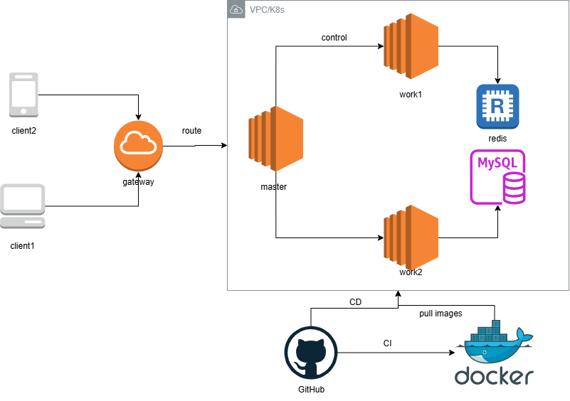
  
项目整体架构图

  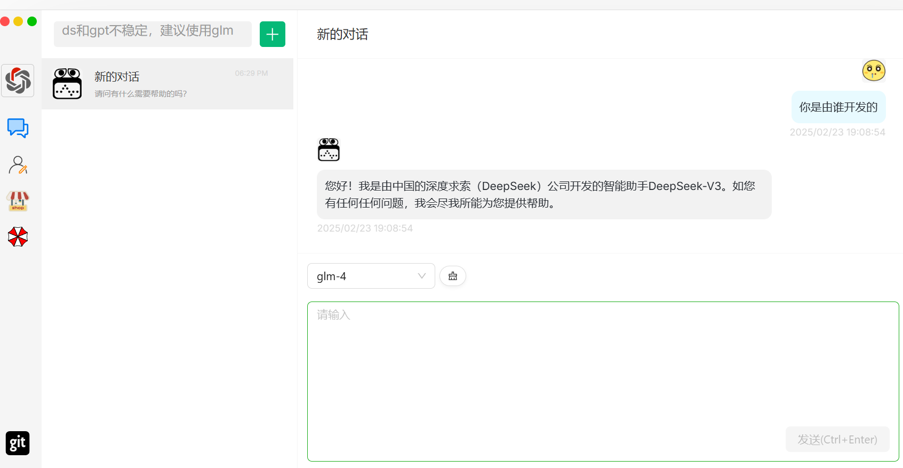
  
演示demo

  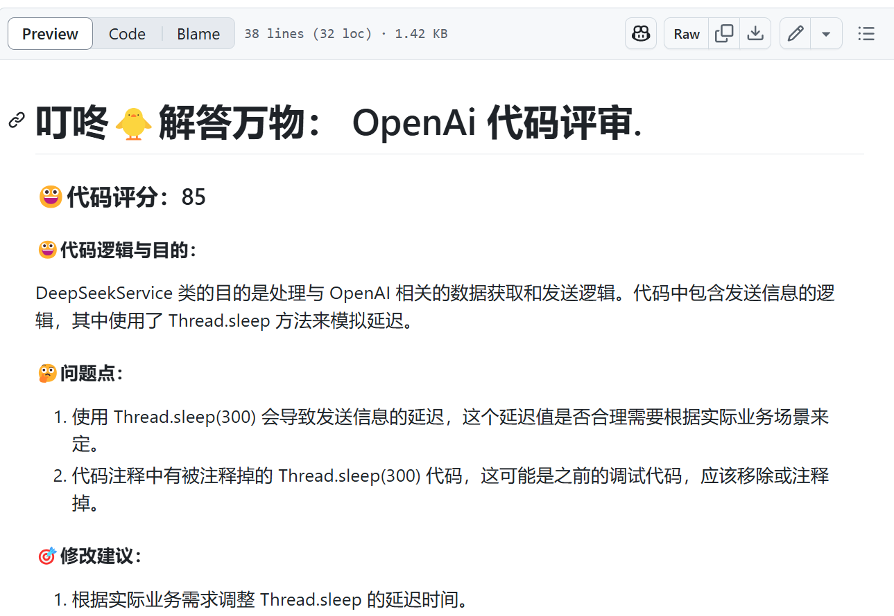
  
CodeReview功能

  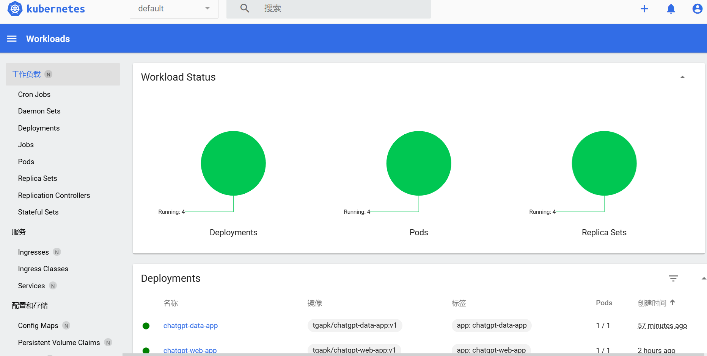
  
K8S部署

**基于BERT的烂番茄影评情绪分类**

Ongoing,目前实现了基于MLP(59%) CNN(63%) RNN(82%)的分类

通过从传统模型的完整实践，深入理解NLP任务中特征工程、局部语义建模、序列依赖关系、上下文感知等核心技术的迭代逻辑，建立对深度学习模型设计原则（如参数量、计算效率、泛化能力）的全局认知。之后拓展至Transformer自注意力机制，复现BERT并对比RNN在长文本情感捕捉中的性能差异，探索预训练（如Masked Language Modeling）对领域适配性的提升作用。

  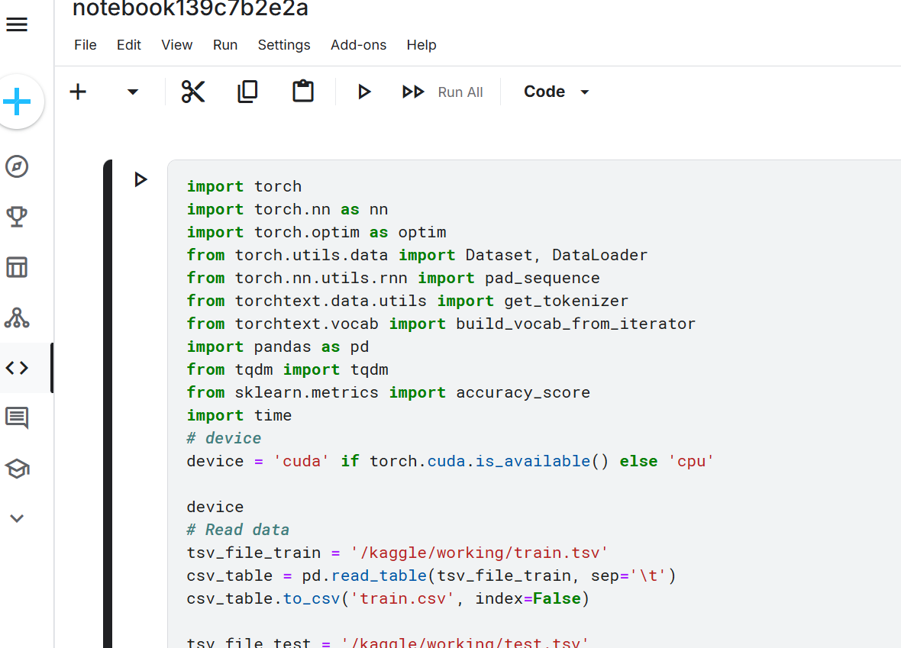
  
RNN分类

  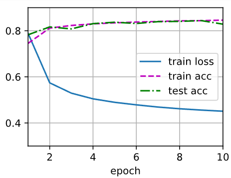
  
训练过程示意图

# 🎓 Education

- **计算机科学与技术 (2020.9 - 2024.6)**

    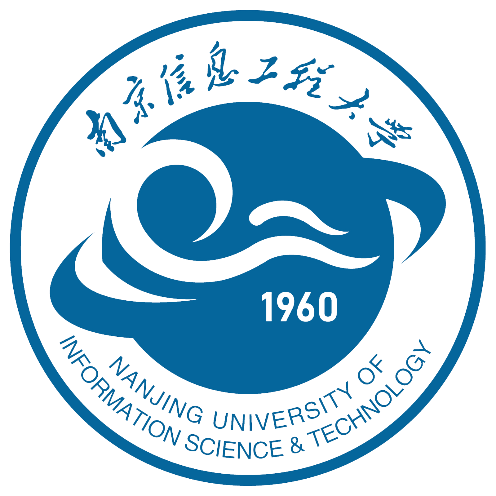
    

        <blockquote>
            南京信息工程大学
        </blockquote>
    

 
<li>在本科阶段我培养了良好的计算机专业素养和扎实的代码能力  </li>
<li>我特别关注计算机的工程应用，尤其是Web开发与系统软件，积累了较为深入的实践经验。</li>
  
[本科成绩单](http://xihuanwanyuanshen.icu/static/grade.pdf)

# 💼 Work Experience

- **JAVA开发实习生, 中国电信  (2023.1 - 2023.3)** 

    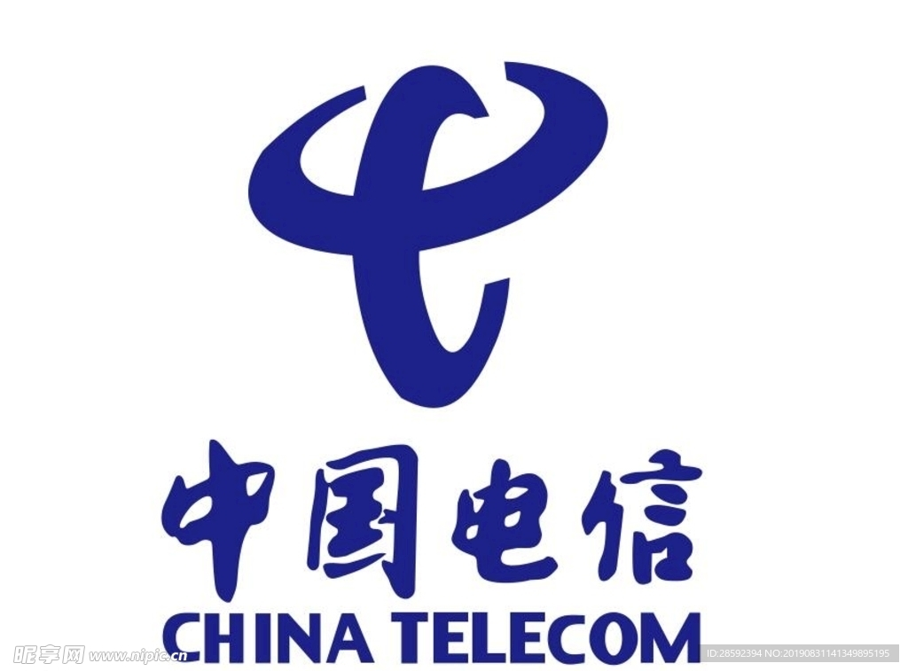
        <blockquote>
            <li>参与旗下微信小程序118114聪明生活的开发和维护</li>
            <li>独立完成流量提速业务功能的升级改造</li>
            <li>开发基于JWT的token登录功能</li>
            <li>改进发送短信接口,防止短信爆破</li>
            <li>使用基于Redisson的延时队列处理超时订单</li>
        </blockquote>

- **云服务工程师, 三星中国研发中心  (2024.4 - 2024.9)** 

    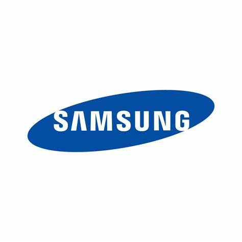
        <blockquote>
          <li> 就职的IoT部门负责<a href="https://www.samsung.com/us/smartthings/" target="_blank">三星物联网(SmartThings)</a>相关生态的开发</li>
          <li> 我所在的DA_Service_Team主要负责为智能设备提供后端服务。</li>
          <li>和英国团队合作，进行<a href="https://samsungfood.com/" target="_blank">SamsungFood</a>的中国区开发和部署</li>
          <li>基于AWS开发云原生应用</li>
          <li>使用英语作为日常工作交流语言</li>
        </blockquote>

# 🏆 Honors and Awards

<ul>
  <li>蓝桥杯C++江苏省二等奖 2022</li>
  <li>校二等奖学金 2021</li>
  <li>校ACM竞赛三等奖 2020</li>
</ul>

# 🛠️ Skills

- **Programming Languages**: JAVA, C++, SQL, TypeScript, Python

  
  
  
  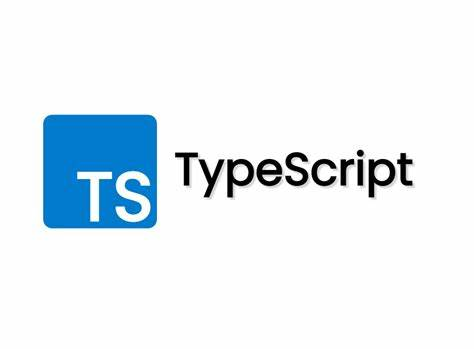
  

    <li>JAVA 是我使用最多的语言，熟悉从 JVM 到常用框架，具有大量工程经验</li>
    <li>熟悉 C++ 的基本语法和高级特性，如指针、引用、STL。</li>
    <li>能够编写复杂的查询语句，了解数据库优化技巧如索引的使用。</li>
    <li>使用JS开发过简单前端应用，与后端 API 进行数据交互</li>
    <li>能够使用 Python 进行数据处理、机器学习模型开发</li>

- **Operating Systems**: Linux, Git, Docker, AWS, Kubernetes

  
  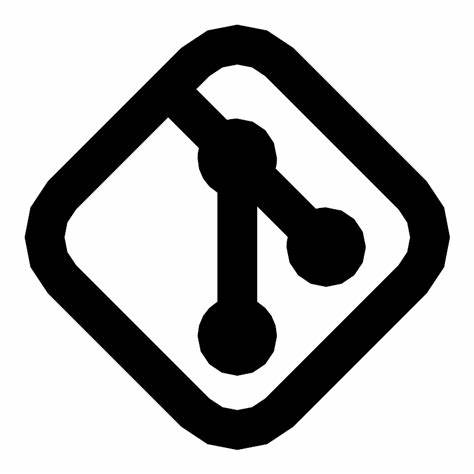
  
  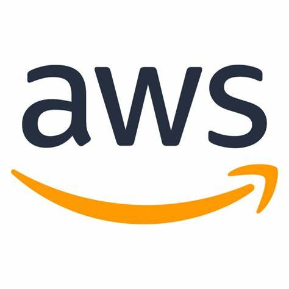
  

    <li>熟悉 Linux 的基本操作和工具，使用 Linux 作为开发和部署环境，并能够排查系统问题</li>
    <li>熟练掌握 Git 的基本操作，能够在团队中高效协作，并与 CI/CD 工具集成以实现自动化部署。</li>
    <li>熟悉 Docker 的基本概念和操作，使用 Docker 来隔离开发环境、简化部署流程</li>
    <li>熟悉 AWS 的核心服务，如 EC2、Lambda，使用 AWS 构建和部署云原生应用</li>
    <li>熟悉 Kubernetes 的核心概念，使用 Kubernetes 来管理容器化应用的部署和扩展，并能够与 CI/CD 工具集成以实现持续交付</li>

- **Database and Tools**:  Mysql, Redis, Mongo, Kafka, Nginx

  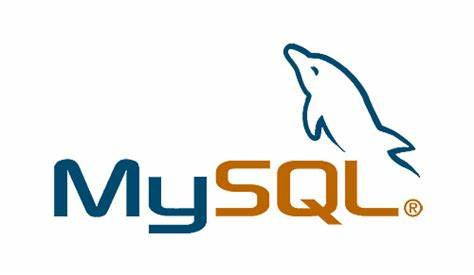
  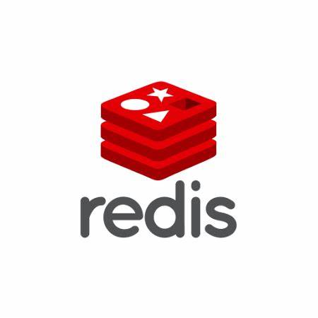
  
  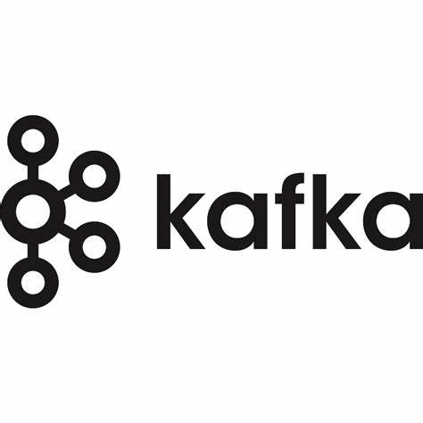
  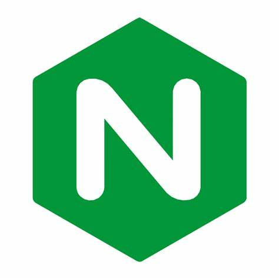

