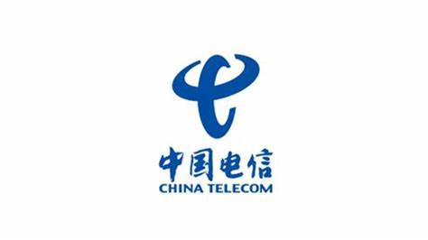








  <h2>Hi, I am tiangan :)</h2>

# 📄 Projects

**[AI Chatbot](http://xihuanwanyuanshen.icu/)**

本项目基于先进的LLM（大语言模型）技术，整合了DeepSeek、OpenAI等领先的生成式AI模型，提供高效、智能的对话服务。项目采用现代化的微服务架构，部署于云端，具备高可用性和可扩展性，能够满足多样化的业务需求。
* 项目采用DDD架构设计，通过清晰的领域划分和模块化设计，确保各功能模块的独立性和可维护性。结合多种设计模式，代码结构简洁高效，便于后续迭代和扩展。
* 通过异步流式响应技术，显著降低了接口响应时间，提升了用户体验。同时，采用责任链模式实现了多层次的功能扩展，包括登录鉴权、访问频率限制、敏感词过滤等，确保系统的安全性和稳定性。
* 基于GitHub Actions实现了完整的CI/CD流程，支持自动化代码构建、测试、镜像打包及发布。结合LLM技术，创新性地引入了自动化代码评审功能，进一步提升了代码质量和开发效率。
* 项目依托Kubernetes（k8s）进行容器化部署，充分利用其弹性伸缩和负载均衡能力，确保服务的高可用性和高性能。同时，通过监控和日志系统，实现了对系统运行状态的实时跟踪和优化。

**基于BERT的自然语言推理模型（进行中）**
<!-- 本项目以自然语言推理任务为核心，通过在SNLI数据集上微调BERT模型，实现了文本语义关系的精准识别与分类。
* 项目基于BER语言模型，在SNLI数据集上进行微调，显著提升了模型在自然语言推理任务上的性能。这一过程深入实践了迁移学习的核心思想，展现了利用大规模预训练模型解决特定领域任务的能力。
* 项目涵盖了从数据预处理、模型训练到性能评估的完整深度学习流程。通过实践，深入掌握了词嵌入、注意力机制以及Transformer架构等核心NLP技术，为后续研究更复杂的语言模型奠定了基础。
* 在微调过程中，项目采用了学习率调度、梯度裁剪等优化技术，确保模型训练的稳定性和高效性。同时，通过准确率、F1值等指标对模型性能进行了全面评估，验证了模型在文本语义推理任务上的有效性。 -->

# 🎓 Education

- **Undergraduate Student of Computer Science and Technology  (2020.9 - 2024.6)**

    
    

        <blockquote>
            Nanjing University of Information 
            Science and Technology
        </blockquote>
    

 
<li>在本科阶段，我深入学习了从数字电路到人工智能的各项计算机基础知识，阅读了《Modern Operating System》、《CSAPP》等经典教材，并通过实践逐步探索了“hello, world”背后的深层次原理。  </li>
<li>在这一过程中，我特别关注计算机的工程应用，尤其是Web开发与系统软件，积累了较为深入的实践经验。</li>
<li>通过这些学习和实践，我更加坚定了在计算机领域深耕细作的决心，期望在研究生阶段能够进一步深化专业知识，拓宽技术视野。 </li>
  
[本科成绩单](http://xihuanwanyuanshen.icu/static/grade.pdf)

# 💼 Employment

- **JAVA开发实习生, 中国电信  (2023.1 - 2023.3)** 

    
        <blockquote>
            <li>参与旗下微信小程序118114聪明生活的开发和维护</li>
            <li>独立开发完成流量提速业务功能的升级改造</li>
            <li>开发基于JWT的token登录功能</li>
            <li>改进发送短信接口,防止短信爆破</li>
            <li>使用基于Redisson的延时队列处理超时订单</li>
        </blockquote>

- **云服务工程师, 三星中国研发中心  (2024.6 - 2024.9)** 

    
        <blockquote>
          <li> 就职的Iot部门负责<a href="https://www.samsung.com/us/smartthings/" target="_blank">三星物联网(SmartThings)</a>相关生态的开发</li>
          <li> 我所在的DA_Service_Team主要负责如<a href="https://samsungfood.com/" target="_blank">SamsungFood</a>等服务的开发，为智能设备提供内容支持。</li>
          <li>任职期间我主要负责和英国团队进行对接，进行SamsungFood的中国区特性开发和部署</li>
          <li>工作中主要使用的技术栈和文化为JAVA、TypeScript、AWS、DevOps，构建云服务</li>
          <li>英语工作环境以及和世界各地的同事的对接锻炼了我的英语和团队合作能力</li>
        </blockquote>

# 🏆 Honors and Awards

<ul>
  <li>蓝桥杯C++江苏省二等奖 2022</li>
  <li>校二等奖学金 2021</li>
  <li>校ACM竞赛三等奖 2020</li>
</ul>

# 🛠️ Skills

- **Programming Languages**: JAVA, C++, SQL, TypeScript, Python

  
  
  
  
  

    <li>JAVA是我使用最多的语言，熟悉包括从JVM到语言特性到框架，具有大量工程经验</li>
    <li>我会用C++写算法题，熟悉它的STL及部分特性</li>
    <li>SQL几乎成了所有后端工程师的必备技能了，我可以使用SQL写复杂查询</li>
    <li>我使用JS写过页面，工作后发现TS构建服务也很方便，欣赏动态语言的干练，但并不熟练</li>
    <li>使用Python完成一些机器学习方面的任务</li>

- **Operating Systems**: Linux, Git, Docker, AWS, Kubernetes

  
  
  
  
  

    <li>在工作和学习中我会大量使用Linux，熟悉其概念和使用</li>
    <li>日常使用Git进行代码管理和合作开发</li>
    <li>系统学习过AWS，熟悉其组件和服务架构</li>
    <li>使用docker+k8s部署可移植和高可用的应用</li>

- **Database and Tools**:  Mysql, Redis, Mongo, Kafka, Nginx

  
  
  
  
  

